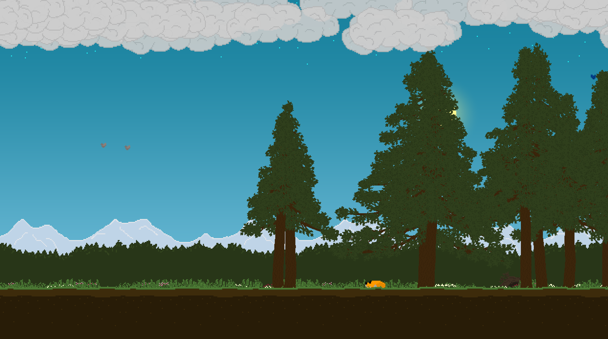

# Independent Video Game Development

This folder hosts HTML executables for the independent video game projects that I have completed. *Use the links below to play the games in-browser for free.*

## A Forest Scene

*A Forest Scene* is a passive, procedurally-generated simulation built from the ground-up in the GameMaker Studio 2 game engine.

All dynamic elements in the game are randomly generated, so every time you load the game, the scene will always be different. The weather patterns, locations of grass and flowers, and all animal behaviors are unique every time the game is played. Trees are grown using procedural generation. Some notable technologies that I have implemented in this game include the following:

- A completely self-sustaining weather system
- Procedurally-generated trees, written by hand
- GLSL shader writing (used for blending colors in the sky and viewing through leaves, tall grass, and flowers)
- Animal behaviors modeled from observing their real-life counterparts

Link to play [A Forest Scene](https://misnomer2.itch.io/a-forest-scene) *(playable in-browser!)*

## Plundered & Going Under

*Plundered & Going Under* was made in 3 hours for Trijam #195 using GameMaker Studio 2.

*You've just plundered some booty from a nearby treasure trove, and you're trying to get back to the mainland -- but your boat starts to spring leaks! Choose between tossing some of your treasure overboard to sink slower or take time to repair your ship. How much treasure can you reach the mainland with, if any at all?*

Link to play [Plundered & Going Under](https://misnomer2.itch.io/plundered-and-going-under) *(playable in-browser!)*
